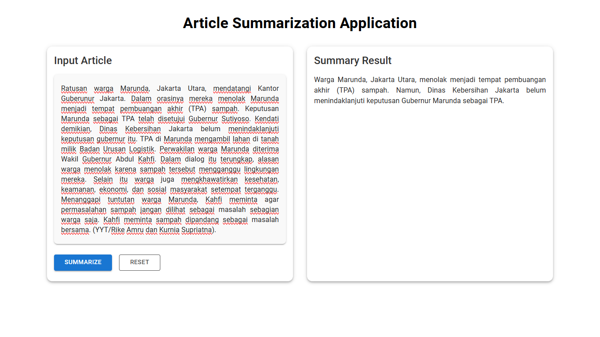
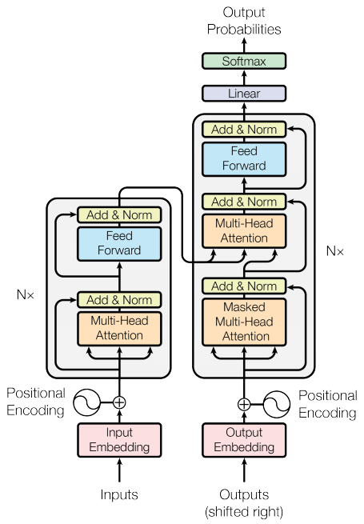

# 🧠 Abstractive Text Summarization for Indonesian News using BART

  

---

## 📌 Overview Project

### 💡 Concept
This project focuses on developing an **Abstractive Text Summarization** system using **BART (Bidirectional and Auto-Regressive Transformer)** to generate automatic summaries of Indonesian-language news articles. The objective is to fine-tune a pre-trained BART model on the **Liputan6** dataset so it can understand context and generate semantically coherent summaries, rather than simply extracting fragments.

---

## 🔧 Technical Details

### 🧪 Model Architecture

  

- Pre-trained: `facebook/bart-base`
- Architecture: Encoder-Decoder (BERT-like encoder + GPT-like decoder)
- Flow:  
  `Tokenization → Embedding → Positional Encoding → Multi-Head Attention → Feed Forward → Decoding → Output`

---

### 📚 Dataset
- Source: Liputan6 Indonesian News Dataset
- Input: Full article text  
- Target: Article headline or summary

---

## 🛠️ Project Workflow

### 1. Preprocessing
- Cleaned and normalized text
- Filtered samples by token length
- Dataset split: 80% training / 10% validation / 10% test

### 2. Tokenization
- Using `BartTokenizer`
- Produces `input_ids`, `attention_mask`

### 3. Input Embedding
- Visualized with PCA and heatmaps

### 4. Positional Encoding
- Sinusoidal pattern encoding

### 5. Multi-Head Attention
- Multi-head attention weights between tokens

### 6. Output & Decoding
- Output token distribution

---

## 🔁 Application Flow

1. User inputs a news article  
2. BART model processes the input  
3. A new summary is generated  
4. Visualizations (optional for interpretability)

---

## ✅ Functions & Benefits

- Summarizes Indonesian-language news articles
- Supports media monitoring and newsroom workflows
- Demonstrates real-case NLP for low-resource languages

---

## 💻 Technical Info

### 📁 Public Repository  
[https://github.com/username/abstractive-text-summarization](https://github.com/raybnsr/abstractive-text-summarization)

### 👤 Role  
- NLP Engineer / Researcher  
- Fullstack Developer

### 🧑‍💻 Programming Languages  
- Python

### 🛠️ Tools & Libraries
- PyTorch, Hugging Face Transformers
- Google Colab
- Matplotlib, Seaborn
- NumPy, Pandas, Scikit-learn
- Graphviz, PCA
- Git & GitHub

---

## 🔄 Future Development

- Deploy via Gradio / Streamlit
- Extend to other text domains (education, legal, etc.)
- Combine with extractive summarization (hybrid method)

---

## 📝 License

This project is under the [MIT License](LICENSE).

---

## 🙌 Acknowledgements

- Hugging Face Community  
- Liputan6 Dataset Contributors  
- Academic Supervisor and Review Panel
